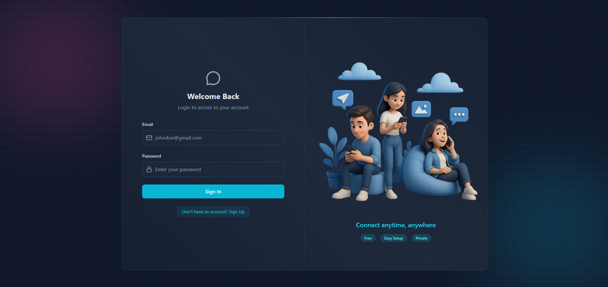

# 💬 ChatEase



---

## 🌐 Live (Hosted on VPS with custom domain)

🔗 https://chatease.rahultech.in

---

## ✨ Features

- 🔐 Custom JWT Authentication (no third-party auth)
- ⚡ Real-time Messaging using Socket.io
- 🟢 Online/Offline Presence Indicators
- 🔔 Typing & Notification Sounds (with toggle)
- 📨 Welcome Emails on Signup (via Gmail SMTP)
- 🗂️ Image Uploads (Cloudinary)
- 🧰 REST API built with Node.js & Express
- 🧱 MongoDB for data persistence
- 🚦 API Rate Limiting using Arcjet
- 🎨 Modern UI with React, Tailwind CSS & DaisyUI
- 🧠 Zustand for state management

---

## ⚙️ Environment Setup

### Backend (`/backend`)

Create a `.env` file inside the backend folder:

```env
# Server
PORT=3000
NODE_ENV=development

# Database
MONGO_URI=your_mongo_uri_here

# Auth
JWT_SECRET=your_jwt_secret

# Email (SMTP)
EMAIL_HOST=smtp.gmail.com
EMAIL_PORT=465
EMAIL_USERNAME=your_smtp_username
EMAIL_PASSWORD=your_smtp_password

# Client
CLIENT_URL=http://localhost:5173

# Cloudinary
CLOUDINARY_CLOUD_NAME=your_cloudinary_cloud_name
CLOUDINARY_API_KEY=your_cloudinary_api_key
CLOUDINARY_API_SECRET=your_cloudinary_api_secret

# Arcjet
ARCJET_KEY=your_arcjet_key
ARCJET_ENV=development